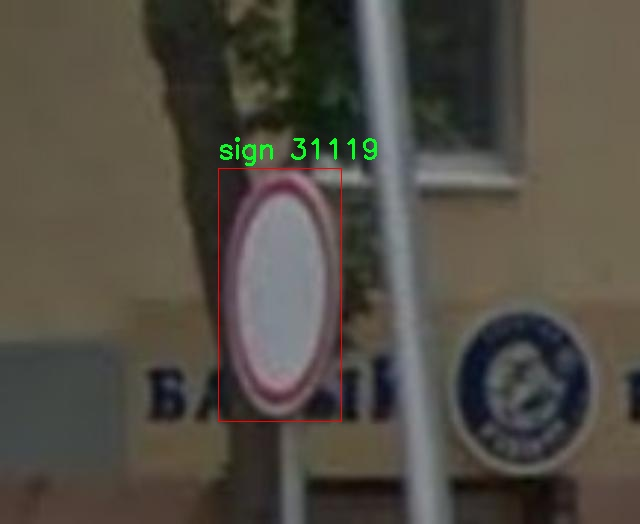

# 交通场景交通标识检测系统源码分享
 # [一条龙教学YOLOV8标注好的数据集一键训练_70+全套改进创新点发刊_Web前端展示]

### 1.研究背景与意义

项目参考[AAAI Association for the Advancement of Artificial Intelligence](https://gitee.com/qunmasj/projects)

研究背景与意义

随着城市化进程的加快，交通管理面临着越来越大的挑战。交通标识作为道路安全的重要组成部分，承担着引导驾驶员和行人、维护交通秩序的关键职责。然而，传统的交通标识检测方法往往依赖人工巡查，不仅效率低下，而且容易受到人为因素的影响，导致漏检和误检现象的发生。因此，开发一种高效、准确的交通标识检测系统显得尤为重要。近年来，深度学习技术的迅猛发展为交通标识检测提供了新的解决方案，其中基于YOLO（You Only Look Once）系列模型的目标检测技术因其实时性和高准确率而受到广泛关注。

YOLOv8作为YOLO系列的最新版本，具有更强的特征提取能力和更快的推理速度，适合在复杂的交通场景中进行实时检测。然而，尽管YOLOv8在目标检测领域表现出色，但在交通标识检测方面仍存在一些不足之处，例如对小型标识的检测能力不足、在复杂背景下的鲁棒性较差等。因此，针对这些问题，对YOLOv8进行改进，以提升其在交通场景中的应用效果，具有重要的研究意义。

本研究将基于改进YOLOv8的交通场景交通标识检测系统，利用robocrossproject数据集进行训练和测试。该数据集包含5812张图像，涵盖193个类别的交通标识，种类繁多，包含了从常见的交通信号灯、限速标志到特定的区域标识等多种类型。这为模型的训练提供了丰富的样本，有助于提高模型的泛化能力和适应性。通过对这些数据的深入分析和处理，可以更好地理解不同交通标识在各种环境下的表现，从而为模型的改进提供数据支持。

此外，交通标识的准确检测不仅有助于提高交通安全，减少交通事故的发生，还能为智能交通系统的建设提供基础数据支持。随着自动驾驶技术的发展，交通标识的自动识别和理解将成为智能车辆与环境交互的重要环节。因此，研究基于改进YOLOv8的交通标识检测系统，不仅具有学术价值，也具有广泛的应用前景。

综上所述，本研究的背景和意义在于通过改进YOLOv8模型，提升交通标识检测的准确性和实时性，进而为城市交通管理和智能交通系统的发展提供有力支持。通过充分利用robocrossproject数据集中的丰富信息，本研究将为交通标识检测领域的进一步探索奠定基础，推动相关技术的进步与应用。

### 2.图片演示


##### 注意：由于此博客编辑较早，上面“2.图片演示”和“3.视频演示”展示的系统图片或者视频可能为老版本，新版本在老版本的基础上升级如下：（实际效果以升级的新版本为准）

  （1）适配了YOLOV8的“目标检测”模型和“实例分割”模型，通过加载相应的权重（.pt）文件即可自适应加载模型。

  （2）支持“图片识别”、“视频识别”、“摄像头实时识别”三种识别模式。

  （3）支持“图片识别”、“视频识别”、“摄像头实时识别”三种识别结果保存导出，解决手动导出（容易卡顿出现爆内存）存在的问题，识别完自动保存结果并导出到。

  （4）支持Web前端系统中的标题、背景图等自定义修改，后面提供修改教程。

  另外本项目提供训练的数据集和训练教程,暂不提供权重文件（best.pt）,需要您按照教程进行训练后实现图片演示和Web前端界面演示的效果。

### 3.视频演示

[3.1 视频演示](https://www.bilibili.com/video/BV1MbWSe6ERs/?vd_source=ff015de2d29cbe2a9cdbfa7064407a08)

### 4.数据集信息展示

数据集信息展示

本数据集名为“robocrossproject”，专为改进YOLOv8的交通场景交通标识检测系统而设计，旨在为研究人员和开发者提供丰富的训练数据。该数据集包含5812张图像，涵盖了193个类别的交通标识，这些类别不仅包括常见的交通标志，还涵盖了多种语言和样式的标识，确保了数据集的多样性和实用性。

在这5812张图像中，数据集通过精心挑选和标注，确保每个类别的标识都能在不同的环境和条件下得到有效的展示。这些图像可能来源于城市街道、乡村道路、交通繁忙的交叉口等多种场景，提供了丰富的背景和光照变化，以帮助模型在实际应用中更好地识别和分类交通标识。

数据集中包含的193个类别涵盖了从基础的交通标志到复杂的指示牌，具体类别包括速度限制、禁止通行、行人过街、以及多种颜色的交通信号灯等。类别编号从0到193，具体的类别名称包括但不限于“Varning för farlig kurva”（危险弯道警告）、“barrier”（障碍物）、“green”（绿色信号）、“red”（红色信号）、“yellow”（黄色信号）等。此外，数据集中还包含了多种语言的标识，如俄语的“Автобус”（公交车）、“Велосипедная дорожка”（自行车道）等，体现了交通标识的国际化特征。

数据集的设计考虑到了现实世界中交通标识的多样性和复杂性，因此在标注过程中采用了严格的标准，以确保每个标识的准确性和一致性。这对于训练YOLOv8模型至关重要，因为模型的性能在很大程度上依赖于训练数据的质量和多样性。通过使用此数据集，研究人员可以有效地训练出能够在各种环境中准确识别交通标识的模型，从而提高自动驾驶系统的安全性和可靠性。

此外，该数据集遵循CC BY 4.0许可证，允许用户在遵循相关条款的前提下自由使用和分享数据。这种开放的许可协议促进了学术界和工业界的合作，使得更多的研究人员和开发者能够利用这一宝贵的资源，推动交通标识检测技术的发展。

总之，“robocrossproject”数据集为改进YOLOv8的交通场景交通标识检测系统提供了一个全面且多样化的基础，旨在提升模型的准确性和实用性。通过充分利用这一数据集，研究人员和开发者可以在交通标识检测领域取得更大的进展，为智能交通系统的未来发展奠定坚实的基础。




### 5.全套项目环境部署视频教程（零基础手把手教学）

[5.1 环境部署教程链接（零基础手把手教学）](https://www.ixigua.com/7404473917358506534?logTag=c807d0cbc21c0ef59de5)


[5.2 安装Python虚拟环境创建和依赖库安装视频教程链接（零基础手把手教学）](https://www.ixigua.com/7404474678003106304?logTag=1f1041108cd1f708b01a)

### 6.手把手YOLOV8训练视频教程（零基础小白有手就能学会）

[6.1 环境部署教程链接（零基础手把手教学）](https://www.ixigua.com/7404477157818401292?logTag=d31a2dfd1983c9668658)

### 7.70+种全套YOLOV8创新点代码加载调参视频教程（一键加载写好的改进模型的配置文件）

[7.1 环境部署教程链接（零基础手把手教学）](https://www.ixigua.com/7404478314661806627?logTag=29066f8288e3f4eea3a4)

### 8.70+种全套YOLOV8创新点原理讲解（非科班也可以轻松写刊发刊，V10版本正在科研待更新）

由于篇幅限制，每个创新点的具体原理讲解就不一一展开，具体见下列网址中的创新点对应子项目的技术原理博客网址【Blog】：


[8.1 70+种全套YOLOV8创新点原理讲解链接](https://gitee.com/qunmasj/good)

### 9.系统功能展示（检测对象为举例，实际内容以本项目数据集为准）

图1.系统支持检测结果表格显示

  图2.系统支持置信度和IOU阈值手动调节

  图3.系统支持自定义加载权重文件best.pt(需要你通过步骤5中训练获得)

  图4.系统支持摄像头实时识别

  图5.系统支持图片识别

  图6.系统支持视频识别

  图7.系统支持识别结果文件自动保存

  图8.系统支持Excel导出检测结果数据


### 10.原始YOLOV8算法原理

原始YOLOv8算法原理

YOLOv8作为YOLO系列的最新版本，代表了目标检测领域的一次重要技术进步。它在设计理念上延续了YOLO系列的快速、准确和易用的特性，同时在网络结构和算法实现上进行了诸多创新，显著提升了检测精度和速度。YOLOv8的网络结构主要由输入端、骨干网络、颈部网络和头部网络四个部分组成，各个部分相辅相成，共同构成了这一高效的目标检测系统。

在输入端，YOLOv8采用了自适应图像缩放技术，以适应不同长宽比的输入图像。这一方法通过将图像的长边缩放到指定尺寸，并对短边进行填充，最大限度地减少了信息冗余。此外，YOLOv8引入了马赛克数据增强技术，通过将四张不同的训练图像随机缩放并拼接，生成新的训练样本。这种增强方式有效提高了模型的泛化能力，使其能够在多样化的场景中保持高效的检测性能。

骨干网络是YOLOv8的核心部分，其设计上参考了YOLOv7中的ELAN模块，采用了新的C2f模块替代了YOLOv5中的C3模块。C2f模块通过增加更多的残差连接，增强了梯度流的丰富性，使得网络在轻量化的基础上能够提取更为复杂的特征信息。这种结构的变化使得YOLOv8在处理不同尺度的目标时，能够更好地融合多层次的特征，提升了模型的整体性能。

颈部网络采用了路径聚合网络（PAN）结构，进一步加强了对不同缩放尺度对象的特征融合能力。通过优化特征图的传递方式，YOLOv8能够有效整合来自骨干网络的多层特征信息，从而提升对目标的检测精度。这一设计使得YOLOv8在面对复杂场景时，能够保持较高的检测准确率。

头部网络是YOLOv8的另一个重要创新点。与以往的耦合头结构不同，YOLOv8采用了解耦头结构，将分类和检测过程分开进行。这一改变不仅简化了模型的设计，还提高了训练和推理的效率。在损失计算方面，YOLOv8使用了二元交叉熵损失（BCELoss）作为分类损失，并结合分布焦点损失（DFLoss）和完全交并比损失（CIOULoss）来优化边界框的回归过程。这种损失函数的设计使得模型在训练过程中能够更快地聚焦于目标的边界，提高了检测的精度。

值得注意的是，YOLOv8在目标检测的方式上进行了根本性的变革，抛弃了传统的基于锚框的检测方法，转而采用无锚框的检测策略。这一策略通过将目标检测转化为关键点检测，避免了预设锚框的复杂性和灵活性不足的问题，使得模型在面对不同类型的目标时，能够更加自适应地进行检测。这种创新不仅简化了模型的结构，还提高了其在多样化场景下的泛化能力。

综上所述，YOLOv8通过对网络结构的深度优化和算法实现的创新，成功地提升了目标检测的性能。其在输入端的自适应缩放、骨干网络的C2f模块、颈部网络的特征融合、头部网络的解耦设计以及无锚框的检测策略等方面的改进，使得YOLOv8在实际应用中表现出色，成为目标检测领域的重要工具。随着YOLOv8的广泛应用，未来的研究和实践将继续推动这一领域的发展，探索更多高效、准确的目标检测解决方案。


### 11.项目核心源码讲解（再也不用担心看不懂代码逻辑）

#### 11.1 ultralytics\hub\__init__.py

以下是经过精简和注释的核心代码部分，主要保留了与用户身份验证、模型导出和数据集检查相关的功能：

```python
# 导入所需的库
import requests
from ultralytics.data.utils import HUBDatasetStats
from ultralytics.hub.auth import Auth
from ultralytics.hub.utils import HUB_API_ROOT, HUB_WEB_ROOT, PREFIX
from ultralytics.utils import LOGGER, SETTINGS, checks

def login(api_key: str = None, save=True) -> bool:
    """
    使用提供的API密钥登录Ultralytics HUB API。

    参数:
        api_key (str, optional): 用于身份验证的API密钥。如果未提供，将从SETTINGS或HUB_API_KEY环境变量中检索。
        save (bool, optional): 如果身份验证成功，是否将API密钥保存到SETTINGS中。
    
    返回:
        bool: 如果身份验证成功，则返回True，否则返回False。
    """
    checks.check_requirements("hub-sdk>=0.0.2")  # 检查所需的库版本
    from hub_sdk import HUBClient  # 导入HUBClient

    # 设置API密钥的URL
    api_key_url = f"{HUB_WEB_ROOT}/settings?tab=api+keys"
    saved_key = SETTINGS.get("api_key")  # 从SETTINGS中获取已保存的API密钥
    active_key = api_key or saved_key  # 确定当前使用的API密钥
    credentials = {"api_key": active_key} if active_key else None  # 设置凭据

    client = HUBClient(credentials)  # 初始化HUBClient

    if client.authenticated:  # 如果身份验证成功
        if save and client.api_key != saved_key:
            SETTINGS.update({"api_key": client.api_key})  # 更新SETTINGS中的API密钥

        # 根据API密钥的来源设置日志消息
        log_message = (
            "New authentication successful ✅" if client.api_key == api_key or not credentials else "Authenticated ✅"
        )
        LOGGER.info(f"{PREFIX}{log_message}")  # 记录成功信息
        return True
    else:
        LOGGER.info(f"{PREFIX}Retrieve API key from {api_key_url}")  # 记录失败信息
        return False

def export_model(model_id="", format="torchscript"):
    """将模型导出为指定格式。"""
    # 检查导出格式是否支持
    assert format in export_fmts_hub(), f"Unsupported export format '{format}', valid formats are {export_fmts_hub()}"
    
    # 发送POST请求以导出模型
    r = requests.post(
        f"{HUB_API_ROOT}/v1/models/{model_id}/export", 
        json={"format": format}, 
        headers={"x-api-key": Auth().api_key}
    )
    
    # 检查请求是否成功
    assert r.status_code == 200, f"{PREFIX}{format} export failure {r.status_code} {r.reason}"
    LOGGER.info(f"{PREFIX}{format} export started ✅")  # 记录导出开始的信息

def check_dataset(path="", task="detect"):
    """
    在上传之前检查HUB数据集Zip文件的错误。

    参数:
        path (str, optional): 数据集Zip文件的路径（内部应包含data.yaml）。默认为''。
        task (str, optional): 数据集任务类型。选项包括'detect'、'segment'、'pose'、'classify'。默认为'detect'。
    
    示例:
        check_dataset('path/to/coco8.zip', task='detect')  # 检查检测数据集
    """
    HUBDatasetStats(path=path, task=task).get_json()  # 获取数据集统计信息
    LOGGER.info(f"Checks completed correctly ✅. Upload this dataset to {HUB_WEB_ROOT}/datasets/.")  # 记录检查完成的信息
```

### 代码说明：
1. **login 函数**：用于登录Ultralytics HUB API，验证API密钥并选择是否保存。
2. **export_model 函数**：将指定的模型导出为给定格式，并检查格式的有效性。
3. **check_dataset 函数**：在上传之前检查数据集的有效性，确保数据集格式正确。

这些函数是与用户交互和数据处理的核心部分，确保了用户能够安全地登录、导出模型和检查数据集。

这个文件是Ultralytics YOLO项目中的一个模块，主要用于与Ultralytics HUB进行交互，提供了一些API登录、登出、模型导出和数据集检查等功能。

首先，文件导入了一些必要的库和模块，包括用于发送HTTP请求的`requests`库，以及Ultralytics项目中的一些工具和设置模块。接下来，定义了多个函数。

`login`函数用于通过提供的API密钥登录Ultralytics HUB API。如果没有提供API密钥，它会尝试从设置或环境变量中获取。成功认证后，可以选择将API密钥保存到设置中。该函数返回一个布尔值，指示认证是否成功，并在日志中记录相关信息。

`logout`函数用于登出Ultralytics HUB，通过清空设置中的API密钥来实现。用户可以通过调用`hub.logout()`来执行登出操作，并在日志中记录登出成功的信息。

`reset_model`函数用于将训练好的模型重置为未训练状态。它通过发送POST请求到HUB API来实现，并根据返回的状态码记录重置结果。

`export_fmts_hub`函数返回HUB支持的模型导出格式的列表，用户可以使用这些格式导出模型。

`export_model`函数用于将指定的模型导出为所需的格式。它首先检查所请求的格式是否受支持，然后发送请求到HUB API进行导出，并在日志中记录导出开始的信息。

`get_export`函数用于获取已导出的模型的字典，包括下载链接。它同样会检查格式的有效性，并发送请求到HUB API获取导出信息。

最后，`check_dataset`函数用于在上传数据集到HUB之前进行错误检查。它会检查给定路径下的ZIP文件是否符合要求，并在检查完成后记录成功的信息，提示用户可以上传数据集。

整体而言，这个文件提供了一系列与Ultralytics HUB交互的功能，方便用户进行模型管理和数据集上传等操作。

#### 11.2 ui.py

以下是代码中最核心的部分，并附上详细的中文注释：

```python
import sys
import subprocess

def run_script(script_path):
    """
    使用当前 Python 环境运行指定的脚本。

    Args:
        script_path (str): 要运行的脚本路径

    Returns:
        None
    """
    # 获取当前 Python 解释器的路径
    python_path = sys.executable

    # 构建运行命令，使用 streamlit 运行指定的脚本
    command = f'"{python_path}" -m streamlit run "{script_path}"'

    # 执行命令
    result = subprocess.run(command, shell=True)
    # 检查命令执行结果，如果返回码不为0，则表示执行出错
    if result.returncode != 0:
        print("脚本运行出错。")

# 实例化并运行应用
if __name__ == "__main__":
    # 指定要运行的脚本路径
    script_path = "web.py"  # 这里可以直接指定脚本名，假设它在当前目录下

    # 调用函数运行脚本
    run_script(script_path)
```

### 代码注释说明：
1. **导入模块**：
   - `sys`：用于访问与 Python 解释器相关的变量和函数。
   - `subprocess`：用于创建新进程、连接到它们的输入/输出/错误管道，并获取返回码。

2. **`run_script` 函数**：
   - 功能：运行指定路径的 Python 脚本。
   - 参数：`script_path`，要运行的脚本的路径。
   - 获取当前 Python 解释器的路径，以确保使用正确的环境来运行脚本。
   - 构建命令字符串，使用 `streamlit` 模块运行指定的脚本。
   - 使用 `subprocess.run` 执行命令，并检查返回码以判断脚本是否成功运行。

3. **主程序部分**：
   - 通过 `if __name__ == "__main__":` 确保只有在直接运行该脚本时才会执行以下代码。
   - 指定要运行的脚本路径（在此示例中为 `web.py`）。
   - 调用 `run_script` 函数来执行指定的脚本。

这个程序文件名为 `ui.py`，主要功能是通过当前的 Python 环境运行一个指定的脚本，具体是一个名为 `web.py` 的文件。程序的核心逻辑是通过 `subprocess` 模块来执行命令行指令。

首先，程序导入了必要的模块，包括 `sys`、`os` 和 `subprocess`，以及一个自定义的 `abs_path` 函数，这个函数可能用于获取文件的绝对路径。

在 `run_script` 函数中，程序接收一个参数 `script_path`，这个参数是要运行的脚本的路径。函数内部首先获取当前 Python 解释器的路径，使用 `sys.executable` 来实现。接着，构建一个命令字符串，命令的格式是使用 Python 解释器运行 `streamlit` 模块，并指定要运行的脚本。

随后，使用 `subprocess.run` 方法执行这个命令。`shell=True` 参数允许在 shell 中执行命令。执行完命令后，程序检查返回的状态码，如果不为零，表示脚本运行出错，并打印相应的错误信息。

在文件的最后部分，使用 `if __name__ == "__main__":` 语句来确保只有在直接运行该文件时才会执行以下代码。此处指定了要运行的脚本路径 `web.py`，并调用 `run_script` 函数来执行这个脚本。

整体来看，这个程序的目的是提供一个简单的接口，通过 Python 环境来运行一个 Streamlit 应用，方便用户进行 web 应用的开发和测试。

#### 11.3 ultralytics\utils\dist.py

以下是经过简化和注释的核心代码部分：

```python
import os
import shutil
import socket
import sys
import tempfile

from . import USER_CONFIG_DIR
from .torch_utils import TORCH_1_9

def find_free_network_port() -> int:
    """
    查找本地主机上一个空闲的网络端口。

    这个函数在单节点训练时非常有用，因为我们不想连接到真实的主节点，但需要设置
    `MASTER_PORT` 环境变量。
    """
    with socket.socket(socket.AF_INET, socket.SOCK_STREAM) as s:
        s.bind(("127.0.0.1", 0))  # 绑定到本地地址和随机端口
        return s.getsockname()[1]  # 返回绑定的端口号


def generate_ddp_file(trainer):
    """
    生成一个 DDP（分布式数据并行）文件并返回其文件名。
    """
    # 获取训练器的模块和类名
    module, name = f"{trainer.__class__.__module__}.{trainer.__class__.__name__}".rsplit(".", 1)

    # 创建文件内容
    content = f"""
# Ultralytics 多GPU训练临时文件（使用后应自动删除）
overrides = {vars(trainer.args)}  # 获取训练器参数

if __name__ == "__main__":
    from {module} import {name}  # 导入训练器类
    from ultralytics.utils import DEFAULT_CFG_DICT

    cfg = DEFAULT_CFG_DICT.copy()  # 复制默认配置字典
    cfg.update(save_dir='')  # 处理额外的 'save_dir' 键
    trainer = {name}(cfg=cfg, overrides=overrides)  # 实例化训练器
    results = trainer.train()  # 开始训练
"""
    # 创建 DDP 目录
    (USER_CONFIG_DIR / "DDP").mkdir(exist_ok=True)
    
    # 创建临时文件并写入内容
    with tempfile.NamedTemporaryFile(
        prefix="_temp_",
        suffix=f"{id(trainer)}.py",
        mode="w+",
        encoding="utf-8",
        dir=USER_CONFIG_DIR / "DDP",
        delete=False,
    ) as file:
        file.write(content)  # 写入内容到临时文件
    return file.name  # 返回临时文件名


def generate_ddp_command(world_size, trainer):
    """
    生成并返回用于分布式训练的命令。
    """
    import __main__  # 本地导入以避免某些问题

    if not trainer.resume:
        shutil.rmtree(trainer.save_dir)  # 如果不恢复训练，删除保存目录
    
    file = generate_ddp_file(trainer)  # 生成 DDP 文件
    dist_cmd = "torch.distributed.run" if TORCH_1_9 else "torch.distributed.launch"  # 根据 PyTorch 版本选择命令
    port = find_free_network_port()  # 查找空闲端口
    # 构建命令列表
    cmd = [sys.executable, "-m", dist_cmd, "--nproc_per_node", f"{world_size}", "--master_port", f"{port}", file]
    return cmd, file  # 返回命令和文件名


def ddp_cleanup(trainer, file):
    """
    如果创建了临时文件，则删除该文件。
    """
    if f"{id(trainer)}.py" in file:  # 检查文件名是否包含临时文件后缀
        os.remove(file)  # 删除临时文件
```

### 代码功能概述：
1. **查找空闲端口**：`find_free_network_port` 函数用于查找本地可用的网络端口，主要用于分布式训练时设置 `MASTER_PORT`。
2. **生成 DDP 文件**：`generate_ddp_file` 函数创建一个临时 Python 文件，包含训练器的配置和训练逻辑。
3. **生成 DDP 命令**：`generate_ddp_command` 函数构建分布式训练的命令行指令，包括必要的参数和临时文件。
4. **清理临时文件**：`ddp_cleanup` 函数在训练结束后删除生成的临时文件，以避免占用磁盘空间。

这个程序文件主要用于支持Ultralytics YOLO框架中的分布式训练，涉及到多GPU的训练配置和管理。文件中包含几个主要的函数，每个函数的功能如下：

首先，`find_free_network_port`函数用于查找本地主机上一个可用的网络端口。这个功能在单节点训练时非常有用，因为在这种情况下，我们不需要连接到真实的主节点，但仍然需要设置`MASTER_PORT`环境变量。函数通过创建一个TCP套接字并绑定到本地地址，获取一个可用的端口号。

接下来，`generate_ddp_file`函数负责生成一个用于分布式数据并行（DDP）训练的临时文件，并返回该文件的名称。该函数首先提取训练器的模块和类名，然后构建一个包含训练参数的Python脚本内容。这个脚本在执行时会导入训练器类，并使用默认配置字典创建训练器实例，最后调用其训练方法。生成的文件会保存在用户配置目录下的“DDP”文件夹中，并且在使用后会被自动删除。

然后，`generate_ddp_command`函数用于生成分布式训练的命令。它首先检查训练器是否需要恢复训练，如果不需要，则删除保存目录。接着调用`generate_ddp_file`生成临时文件，并根据PyTorch的版本选择合适的分布式运行命令（`torch.distributed.run`或`torch.distributed.launch`）。函数还会调用`find_free_network_port`获取一个可用的端口，并最终构建一个包含Python可执行文件、分布式命令、进程数、主端口和临时文件的命令列表。

最后，`ddp_cleanup`函数用于清理临时文件。如果临时文件的后缀与训练器的ID匹配，则删除该文件。这确保了在训练结束后不会留下多余的临时文件，保持文件系统的整洁。

总体来说，这个文件的主要目的是为Ultralytics YOLO框架的分布式训练提供必要的支持，包括生成配置文件、构建命令和清理临时文件等功能。

#### 11.4 ultralytics\models\rtdetr\predict.py

以下是代码中最核心的部分，并附上详细的中文注释：

```python
import torch
from ultralytics.data.augment import LetterBox
from ultralytics.engine.predictor import BasePredictor
from ultralytics.engine.results import Results
from ultralytics.utils import ops

class RTDETRPredictor(BasePredictor):
    """
    RT-DETR (Real-Time Detection Transformer) 预测器，扩展自 BasePredictor 类，用于使用百度的 RT-DETR 模型进行预测。
    该类利用视觉变换器的强大功能，提供实时物体检测，同时保持高精度。支持高效的混合编码和 IoU 感知查询选择等关键特性。
    """

    def postprocess(self, preds, img, orig_imgs):
        """
        对模型的原始预测结果进行后处理，以生成边界框和置信度分数。

        该方法根据置信度和类别（如果在 `self.args` 中指定）过滤检测结果。

        参数:
            preds (torch.Tensor): 模型的原始预测结果。
            img (torch.Tensor): 处理过的输入图像。
            orig_imgs (list or torch.Tensor): 原始的未处理图像。

        返回:
            (list[Results]): 包含后处理后的边界框、置信度分数和类别标签的 Results 对象列表。
        """
        # 获取预测结果的维度
        nd = preds[0].shape[-1]
        # 将预测结果分为边界框和分数
        bboxes, scores = preds[0].split((4, nd - 4), dim=-1)

        # 如果输入图像不是列表，则将其转换为 numpy 格式
        if not isinstance(orig_imgs, list):
            orig_imgs = ops.convert_torch2numpy_batch(orig_imgs)

        results = []
        for i, bbox in enumerate(bboxes):  # 遍历每个边界框
            # 将边界框从中心点格式转换为左上角和右下角格式
            bbox = ops.xywh2xyxy(bbox)
            # 获取当前边界框的最大分数和对应的类别
            score, cls = scores[i].max(-1, keepdim=True)
            # 根据置信度过滤边界框
            idx = score.squeeze(-1) > self.args.conf
            # 如果指定了类别，则进一步过滤
            if self.args.classes is not None:
                idx = (cls == torch.tensor(self.args.classes, device=cls.device)).any(1) & idx
            # 过滤后的预测结果
            pred = torch.cat([bbox, score, cls], dim=-1)[idx]
            orig_img = orig_imgs[i]
            oh, ow = orig_img.shape[:2]  # 获取原始图像的高度和宽度
            # 将边界框坐标缩放到原始图像的尺寸
            pred[..., [0, 2]] *= ow
            pred[..., [1, 3]] *= oh
            img_path = self.batch[0][i]  # 获取图像路径
            # 将结果添加到列表中
            results.append(Results(orig_img, path=img_path, names=self.model.names, boxes=pred))
        return results

    def pre_transform(self, im):
        """
        在将输入图像输入模型进行推理之前，对其进行预处理。输入图像被调整为方形比例并填充。

        参数:
            im (list[np.ndarray] | torch.Tensor): 输入图像，形状为 (N,3,h,w) 的张量，或 [(h,w,3) x N] 的列表。

        返回:
            (list): 预处理后的图像列表，准备进行模型推理。
        """
        # 创建 LetterBox 对象，用于调整图像大小
        letterbox = LetterBox(self.imgsz, auto=False, scaleFill=True)
        # 对每个图像进行调整并返回
        return [letterbox(image=x) for x in im]
```

### 代码核心部分说明：
1. **RTDETRPredictor 类**：该类是 RT-DETR 模型的预测器，继承自 `BasePredictor`，用于进行物体检测。
2. **postprocess 方法**：该方法对模型的原始预测结果进行后处理，生成边界框和置信度分数，并根据置信度和类别进行过滤。
3. **pre_transform 方法**：该方法对输入图像进行预处理，确保图像为方形并填充，以适应模型的输入要求。

这个程序文件 `ultralytics\models\rtdetr\predict.py` 实现了一个基于 RT-DETR（实时检测变换器）模型的预测器类 `RTDETRPredictor`，它继承自 `BasePredictor` 类。该类的主要功能是利用视觉变换器进行实时物体检测，同时保持高精度。它支持高效的混合编码和 IoU（交并比）感知查询选择等关键特性。

在文件开头，导入了必要的库和模块，包括 PyTorch、数据增强模块、预测器基类、结果处理模块以及一些工具函数。类的文档字符串中提供了对 RTDETRPredictor 的详细描述，包括如何使用该类的示例代码。用户可以通过指定模型文件和数据源来创建预测器实例，并调用 `predict_cli` 方法进行预测。

类中定义了两个主要方法：`postprocess` 和 `pre_transform`。

`postprocess` 方法负责对模型的原始预测结果进行后处理，以生成边界框和置信度分数。该方法首先将模型的输出分割为边界框和分数，然后根据置信度和指定的类别进行过滤。处理后的结果以 `Results` 对象的形式返回，包含了原始图像、路径、类别名称和边界框信息。边界框的坐标会根据原始图像的尺寸进行缩放，以确保它们与原始图像的大小一致。

`pre_transform` 方法用于在将输入图像送入模型进行推理之前进行预处理。该方法会将输入图像进行信封填充，以确保其为正方形并且适合模型的输入要求。返回的结果是经过预处理的图像列表，准备好进行模型推理。

总体而言，这个文件实现了一个功能强大的实时物体检测预测器，结合了现代深度学习技术，能够在保持高准确率的同时实现快速的推理速度。

#### 11.5 train.py

以下是经过简化和注释的核心代码部分：

```python
import os
import torch
import yaml
from ultralytics import YOLO  # 导入YOLO模型

# 设置设备为GPU（如果可用），否则使用CPU
device = "0" if torch.cuda.is_available() else "cpu"

if __name__ == '__main__':  # 确保该模块被直接运行时才执行以下代码
    workers = 1  # 数据加载的工作进程数
    batch = 2    # 每个批次的样本数量

    data_name = "data"  # 数据集名称
    # 获取数据集配置文件的绝对路径
    data_path = abs_path(f'datasets/{data_name}/{data_name}.yaml', path_type='current')
    
    # 将路径转换为Unix风格（使用'/'作为分隔符）
    unix_style_path = data_path.replace(os.sep, '/')

    # 获取数据集目录路径
    directory_path = os.path.dirname(unix_style_path)
    
    # 读取YAML文件，保持原有顺序
    with open(data_path, 'r') as file:
        data = yaml.load(file, Loader=yaml.FullLoader)
    
    # 如果YAML文件中包含'path'项，则修改为当前目录路径
    if 'path' in data:
        data['path'] = directory_path
        # 将修改后的数据写回YAML文件
        with open(data_path, 'w') as file:
            yaml.safe_dump(data, file, sort_keys=False)

    # 加载YOLOv8模型配置
    model = YOLO(model='./ultralytics/cfg/models/v8/yolov8s.yaml', task='detect')
    
    # 开始训练模型
    results2 = model.train(
        data=data_path,  # 指定训练数据的配置文件路径
        device=device,   # 指定训练设备
        workers=workers, # 指定数据加载的工作进程数
        imgsz=640,       # 输入图像的大小为640x640
        epochs=100,      # 训练100个epoch
        batch=batch,     # 每个批次的大小
        name='train_v8_' + data_name  # 指定训练任务的名称
    )
```

### 代码注释说明：
1. **导入库**：导入必要的库，包括`os`（用于文件路径操作）、`torch`（用于深度学习框架）、`yaml`（用于读取YAML文件）和`YOLO`（用于目标检测模型）。
2. **设备选择**：根据是否有可用的GPU，选择训练设备为GPU或CPU。
3. **主程序入口**：使用`if __name__ == '__main__':`确保只有在直接运行该脚本时才执行后续代码。
4. **参数设置**：定义数据加载的工作进程数和每个批次的样本数量。
5. **数据集路径**：构建数据集配置文件的绝对路径，并将其转换为Unix风格路径。
6. **读取和修改YAML文件**：读取YAML文件内容，如果存在`path`项，则更新为当前目录路径，并将修改后的内容写回文件。
7. **模型加载**：加载YOLOv8模型的配置文件。
8. **模型训练**：调用模型的`train`方法开始训练，传入必要的参数，如数据路径、设备、工作进程数、图像大小、训练轮数和批次大小等。

这个程序文件 `train.py` 是一个用于训练 YOLOv8 模型的脚本。首先，它导入了必要的库，包括 `os`、`torch`、`yaml` 和 `ultralytics` 中的 YOLO 模型。程序会检查是否有可用的 GPU，如果有，则将设备设置为 "0"（表示使用第一个 GPU），否则使用 CPU。

在 `if __name__ == '__main__':` 语句下，程序确保只有在直接运行该脚本时才会执行以下代码。首先，它定义了工作进程的数量 `workers` 和每个批次的大小 `batch`。接着，程序指定了数据集的名称为 "data"，并构建了数据集 YAML 文件的绝对路径。

程序通过 `abs_path` 函数获取数据集 YAML 文件的绝对路径，并将路径中的分隔符替换为 Unix 风格的斜杠。然后，它提取出目录路径，并打开 YAML 文件以读取数据。读取后，程序检查 YAML 数据中是否包含 `path` 项，如果有，则将其修改为目录路径，并将更新后的数据写回 YAML 文件。

接下来，程序加载了预训练的 YOLOv8 模型，指定了模型的配置文件。之后，调用 `model.train()` 方法开始训练模型。在训练过程中，程序指定了训练数据的配置文件路径、设备、工作进程数量、输入图像的大小（640x640）、训练的 epoch 数量（100）以及训练任务的名称。

整体来看，这个脚本的主要功能是设置和启动 YOLOv8 模型的训练过程，包括数据集的准备和模型的配置。

#### 11.6 ultralytics\trackers\track.py

以下是代码中最核心的部分，并附上详细的中文注释：

```python
# 导入必要的库和模块
from functools import partial
from pathlib import Path
import torch
from ultralytics.utils import IterableSimpleNamespace, yaml_load
from ultralytics.utils.checks import check_yaml
from .bot_sort import BOTSORT
from .byte_tracker import BYTETracker

# 跟踪器类型与对应的跟踪器类的映射
TRACKER_MAP = {"bytetrack": BYTETracker, "botsort": BOTSORT}

def on_predict_start(predictor: object, persist: bool = False) -> None:
    """
    在预测开始时初始化对象跟踪器。

    参数:
        predictor (object): 用于初始化跟踪器的预测器对象。
        persist (bool, optional): 如果跟踪器已经存在，是否保持其状态。默认为 False。

    异常:
        AssertionError: 如果 tracker_type 不是 'bytetrack' 或 'botsort'。
    """
    # 检查任务类型是否为 OBB，若是则抛出异常
    if predictor.args.task == "obb":
        raise NotImplementedError("ERROR ❌ OBB 任务不支持跟踪模式！")
    
    # 如果预测器已有跟踪器且需要保持状态，则直接返回
    if hasattr(predictor, "trackers") and persist:
        return

    # 检查并加载跟踪器的配置文件
    tracker = check_yaml(predictor.args.tracker)
    cfg = IterableSimpleNamespace(**yaml_load(tracker))

    # 确保跟踪器类型有效
    if cfg.tracker_type not in ["bytetrack", "botsort"]:
        raise AssertionError(f"目前只支持 'bytetrack' 和 'botsort'，但得到的是 '{cfg.tracker_type}'")

    # 初始化跟踪器列表
    trackers = []
    for _ in range(predictor.dataset.bs):
        # 根据配置创建对应的跟踪器实例
        tracker = TRACKER_MAP[cfg.tracker_type](args=cfg, frame_rate=30)
        trackers.append(tracker)
    
    # 将创建的跟踪器列表赋值给预测器
    predictor.trackers = trackers

def on_predict_postprocess_end(predictor: object, persist: bool = False) -> None:
    """
    在预测后处理结束时更新检测框并进行对象跟踪。

    参数:
        predictor (object): 包含预测结果的预测器对象。
        persist (bool, optional): 如果跟踪器已经存在，是否保持其状态。默认为 False。
    """
    bs = predictor.dataset.bs  # 批量大小
    path, im0s = predictor.batch[:2]  # 获取路径和图像数据

    for i in range(bs):
        # 如果不保持状态且视频路径不同，则重置跟踪器
        if not persist and predictor.vid_path[i] != str(predictor.save_dir / Path(path[i]).name):  # 新视频
            predictor.trackers[i].reset()

        # 获取当前检测结果
        det = predictor.results[i].boxes.cpu().numpy()
        if len(det) == 0:
            continue  # 如果没有检测到物体，则跳过

        # 更新跟踪器并获取跟踪结果
        tracks = predictor.trackers[i].update(det, im0s[i])
        if len(tracks) == 0:
            continue  # 如果没有跟踪到物体，则跳过

        # 更新预测结果
        idx = tracks[:, -1].astype(int)  # 获取跟踪索引
        predictor.results[i] = predictor.results[i][idx]  # 更新检测结果
        predictor.results[i].update(boxes=torch.as_tensor(tracks[:, :-1]))  # 更新检测框

def register_tracker(model: object, persist: bool) -> None:
    """
    为模型注册跟踪回调，以便在预测期间进行对象跟踪。

    参数:
        model (object): 要注册跟踪回调的模型对象。
        persist (bool): 如果跟踪器已经存在，是否保持其状态。
    """
    # 注册预测开始时的回调
    model.add_callback("on_predict_start", partial(on_predict_start, persist=persist))
    # 注册预测后处理结束时的回调
    model.add_callback("on_predict_postprocess_end", partial(on_predict_postprocess_end, persist=persist))
```

### 代码核心部分说明：
1. **跟踪器初始化**：`on_predict_start` 函数用于在预测开始时初始化跟踪器。它根据配置文件创建相应的跟踪器实例，并将其存储在预测器对象中。
2. **后处理与跟踪**：`on_predict_postprocess_end` 函数在预测结束后进行后处理，更新检测框并进行对象跟踪。它会根据检测结果更新跟踪器的状态，并更新预测结果。
3. **回调注册**：`register_tracker` 函数用于将上述两个函数注册为模型的回调，以便在预测过程中自动调用。

这个程序文件主要实现了在目标检测过程中进行目标跟踪的功能。文件中使用了Ultralytics YOLO框架，并且定义了一些函数来处理跟踪器的初始化和后处理。

首先，文件导入了一些必要的库和模块，包括`torch`、`Path`、`IterableSimpleNamespace`、`yaml_load`和一些跟踪器类（`BOTSORT`和`BYTETracker`）。接着，定义了一个映射字典`TRACKER_MAP`，将跟踪器类型（如“bytetrack”和“botsort”）映射到相应的跟踪器类。

`on_predict_start`函数用于在预测开始时初始化跟踪器。它接收一个预测器对象和一个可选的布尔参数`persist`，用于指示是否在跟踪器已存在时保持其状态。函数首先检查任务类型，如果是“obb”则抛出异常，因为该任务不支持跟踪模式。接着，函数会检查预测器是否已经有跟踪器，并根据`persist`参数决定是否重新初始化跟踪器。通过`check_yaml`函数加载跟踪器的配置，并使用`yaml_load`将其解析为一个命名空间对象。函数会验证跟踪器类型是否有效，并为每个批次创建相应的跟踪器实例，最后将这些跟踪器存储在预测器对象中。

`on_predict_postprocess_end`函数在预测后处理结束时被调用，用于更新检测到的目标框并进行目标跟踪。它同样接收预测器对象和`persist`参数。函数首先获取批次大小和图像数据，然后对每个批次进行处理。如果`persist`为假且视频路径不同，则重置跟踪器。接着，函数获取检测结果，并检查是否有检测到的目标。如果有目标，调用跟踪器的`update`方法进行更新，并根据跟踪结果更新预测器的结果。

最后，`register_tracker`函数用于将跟踪回调注册到模型中，以便在预测过程中进行目标跟踪。它接收模型对象和`persist`参数，并将之前定义的两个回调函数（`on_predict_start`和`on_predict_postprocess_end`）注册到模型中。

总体来说，这个文件的主要功能是实现目标检测中的目标跟踪，提供了初始化跟踪器、更新跟踪结果以及注册回调的功能。

### 12.系统整体结构（节选）

### 整体功能和构架概括

Ultralytics YOLO项目是一个用于目标检测和跟踪的深度学习框架，具有高效的训练和推理能力。该项目的整体架构分为多个模块，每个模块负责特定的功能。主要功能包括模型训练、目标检测、目标跟踪、数据处理和可视化等。通过不同的文件，项目实现了从数据集准备、模型训练、推理到后处理的完整流程，支持多种模型和跟踪算法。

以下是各个文件的功能整理表：

| 文件路径                                      | 功能描述                                               |
|-----------------------------------------------|--------------------------------------------------------|
| `ultralytics/hub/__init__.py`                | 提供与Ultralytics HUB交互的API，包括登录、登出、模型导出和数据集检查等功能。 |
| `ui.py`                                       | 通过命令行运行指定的Streamlit应用（`web.py`），用于用户界面交互。 |
| `ultralytics/utils/dist.py`                  | 支持分布式训练的功能，包括查找可用端口、生成DDP文件和命令、清理临时文件等。 |
| `ultralytics/models/rtdetr/predict.py`       | 实现RT-DETR模型的预测功能，包括输入图像的预处理和输出结果的后处理。 |
| `train.py`                                    | 负责YOLOv8模型的训练过程，包括数据集准备、模型配置和训练启动。 |
| `ultralytics/trackers/track.py`              | 实现目标跟踪功能，包括初始化跟踪器、更新跟踪结果和注册回调。 |
| `ultralytics/utils/plotting.py`              | 提供可视化功能，用于绘制检测结果和跟踪信息。 |
| `ultralytics/models/fastsam/utils.py`        | 包含FastSAM模型的辅助功能，用于处理和生成预测结果。 |
| `ultralytics/trackers/byte_tracker.py`       | 实现BYTETracker算法，用于高效的目标跟踪。 |
| `ultralytics/trackers/bot_sort.py`           | 实现BOTSORT算法，用于目标跟踪，结合了深度学习和传统跟踪方法。 |

通过这些模块，Ultralytics YOLO项目提供了一个全面的框架，支持从数据准备到模型训练、推理和后处理的整个工作流程，适用于各种目标检测和跟踪任务。

注意：由于此博客编辑较早，上面“11.项目核心源码讲解（再也不用担心看不懂代码逻辑）”中部分代码可能会优化升级，仅供参考学习，完整“训练源码”、“Web前端界面”和“70+种创新点源码”以“13.完整训练+Web前端界面+70+种创新点源码、数据集获取”的内容为准。

### 13.完整训练+Web前端界面+70+种创新点源码、数据集获取


#完整训练+Web前端界面+70+种创新点源码、数据集获取链接

https://mbd.pub/o/bread/ZpqUlJ5p